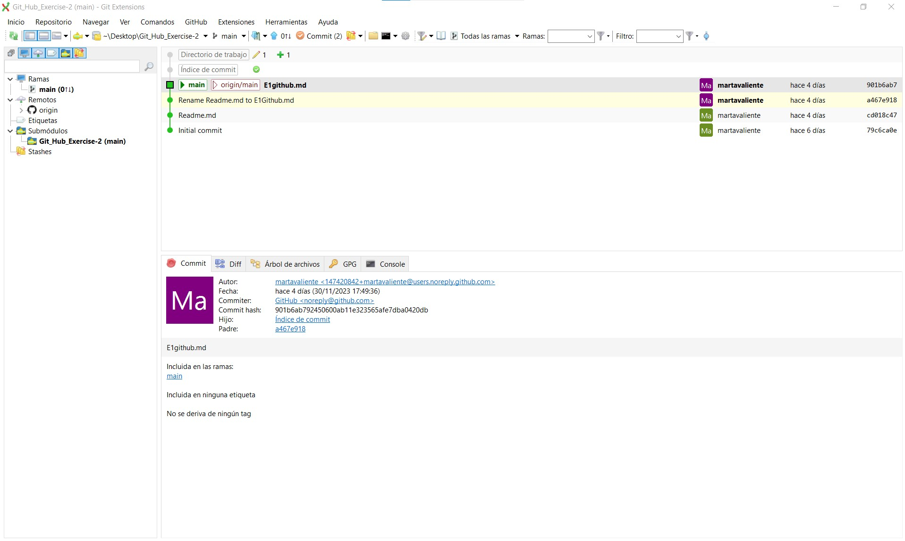

## how you made the repo shareable
- Firt, you enter to github and go to your work.
- Enter to Setting and go to Collaborator.

- Click on ADD PEOPLE and put the name of the person that you want to work.

- When the other person accept the petision, you can work together.

## how it is cloned in Git Extensions
- Firt, You need to install the Git extension.
- when you have it, enter and click Clone repository.

- After, you need to put the link of Github, put where you want the Clone and click the botton Clone.

- When you have all clone you enter to the archive.
